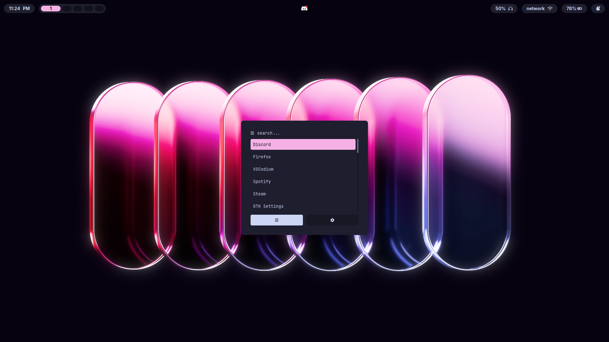
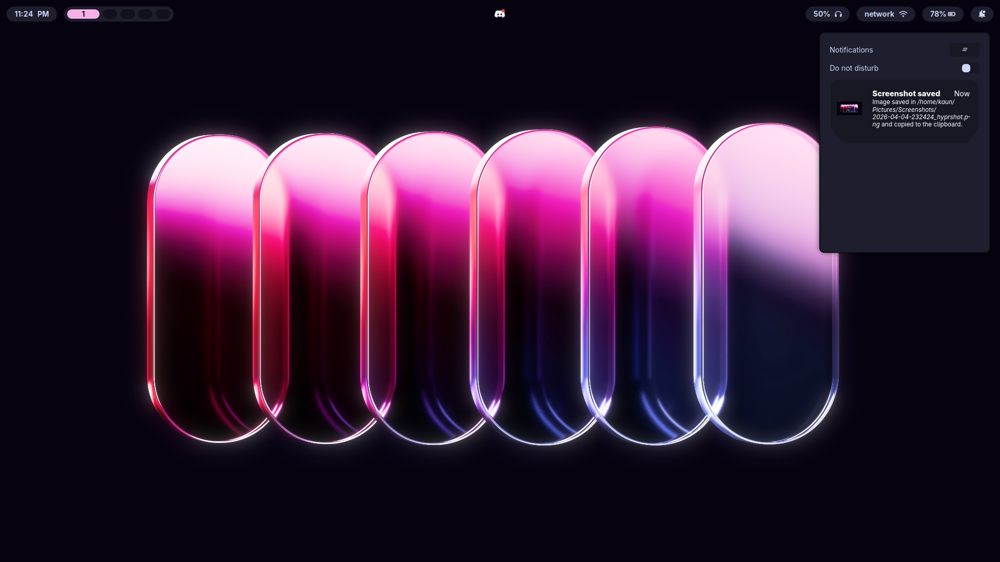
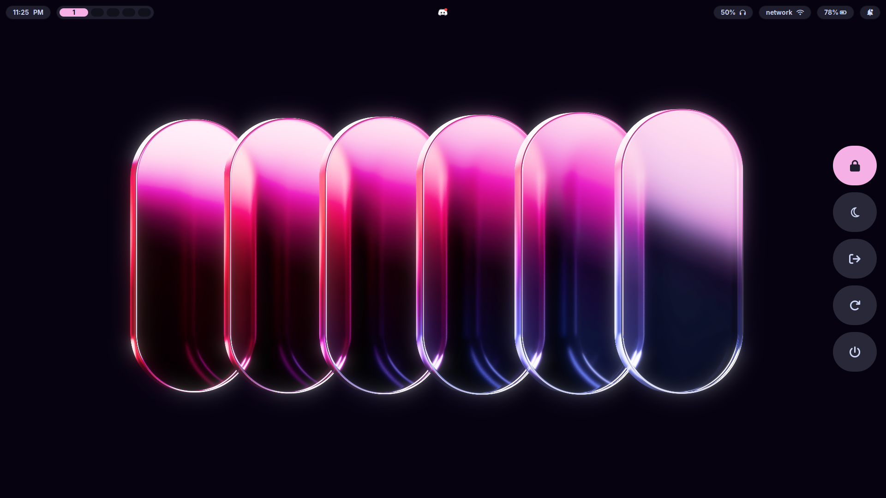

# 🧊 KAUN's Dotfiles

<p align="center">
  <b>Arch Linux • Hyprland • Minimal Rice</b>
</p>

<p align="center">
  <i>Making it worse before it gets better.</i>
</p>

<p align="center">
  
</p>

---

## 📸 Screenshots

<p align="center">
  
  
</p>

<p align="center">
  
  
</p>

<p align="center">
  
</p>

---

## 🖥️ System Info

* **OS:** Arch Linux
* **WM:** Hyprland
* **Terminal:** Kitty
* **Shell:** Zsh
* **Bar:** Waybar
* **Launcher:** Rofi
* **Notifications:** SwayNC

---

## ⚙️ Dependencies

Make sure these are installed:

* hyprland
* kitty
* waybar
* rofi
* swaync
* swww (wallpapers)
* wl-clipboard
* cliphist

---

## 🔤 Fonts

* **Adwaita Sans** → system UI font
* **JetBrains Mono Nerd Font** → terminal + icons

### Install Fonts (Arch)

```bash
sudo pacman -S ttf-jetbrains-mono ttf-adwaita
```

---

## 🎨 What's Customized

* **Hyprland:** keybinds, blur, animations, numlock
* **Waybar:** custom modules + clean CSS
* **Kitty:** Catppuccin theme, fonts, opacity
* **Rofi:** launcher + custom powermenu

---

## 📦 Installation

### 1. Clone the repo

```bash
git clone https://github.com/kaunkrishna/dotfiles
cd dotfiles
```

### 2. Backup your current config (important)

```bash
mv ~/.config ~/.config-backup
```

### 3. Copy configs

```bash
cp -r * ~/.config/
```

---

## ⚠️ Notes

* This setup is built for **Arch + Hyprland**
* Things may break on other setups
* Read configs before using (don’t blindly paste)

---

## ⭐ Support

If you like this setup:

* Star the repo ⭐
* Fork it
* Or just steal what you like (that’s the point)

---

<p align="center">
  <i>rice > everything</i>
</p>
