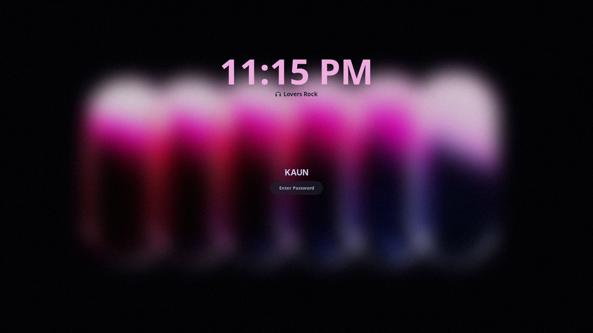

# KAUN's Dotfiles

<p align="center">
  <b>Arch Linux • Hyprland • Minimal Rice</b>
</p>

<p align="center">
  <i>Making it worse before it gets better.</i>
</p>

<p align="center">
  
</p>

---

## Styles

<p align="center">
  <b>Desktop</b>&nbsp;&nbsp;&nbsp;&nbsp;&nbsp;&nbsp;&nbsp;&nbsp;&nbsp;&nbsp;&nbsp;&nbsp;&nbsp;&nbsp;&nbsp;&nbsp;&nbsp;&nbsp;&nbsp;&nbsp;&nbsp;&nbsp;&nbsp;&nbsp;&nbsp;&nbsp;&nbsp;&nbsp;&nbsp;&nbsp;&nbsp;&nbsp;&nbsp;&nbsp;&nbsp;&nbsp;<b>Rofi Launcher</b>
</p>

<p align="center">
  
  
</p>

<p align="center">
  <b>Hyprlock Lockscreen</b>&nbsp;&nbsp;&nbsp;&nbsp;&nbsp;&nbsp;&nbsp;&nbsp;&nbsp;&nbsp;&nbsp;&nbsp;&nbsp;&nbsp;&nbsp;&nbsp;&nbsp;&nbsp;&nbsp;&nbsp;&nbsp;&nbsp;<b>SwayNC Notifications</b>
</p>

<p align="center">
  
  
</p>

<p align="center">
  <b>Rofi Powermenu</b>
</p>

<p align="center">
  
</p>

---

## System Info

* **OS:** Arch Linux
* **WM:** Hyprland
* **Terminal:** Kitty
* **Shell:** Zsh
* **Bar:** Waybar
* **Launcher:** Rofi
* **Notifications:** SwayNC

---

## Dependencies

```bash
sudo pacman -S --needed hyprland kitty waybar rofi swaync swww wl-clipboard cliphist
```

---

## Fonts

* Adwaita Sans → system UI
* JetBrains Mono Nerd Font → terminal + icons

```bash
sudo pacman -S --needed ttf-jetbrains-mono ttf-adwaita
```

---

## Installation

### 1. Clone

```bash
git clone https://github.com/kaunkrishna/dotfiles
cd dotfiles
```

### 2. Backup

```bash
mv ~/.config ~/.config-backup
```

### 3. Apply configs

```bash
cp -r * ~/.config/
```

### 4. Restart session

---

## Notes

* Built for Arch + Hyprland
* May break on other setups
* Read configs before using

---

## Support

Star the repo if you like it ⭐

<p align="center">
  <i>rice > everything</i>
</p>
